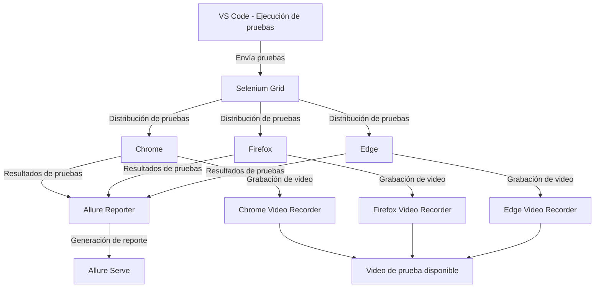

# UNIVERSIDAD PRIVADA DE TACNA
## Facultad de Ingeniería
## Escuela profesional de Ingeniería de Sistemas

### Proyecto: Juegos Florales
### Pruebas de Aceptación/Interfaz

### Integrantes:
| ID  | Nombres           | Apellidos           | Código      |
| --- | ----------------- | ------------------- | ----------- |
| 1   | Jean Pier Elias   | Valverde Zamora     | 2020066920  |
| 2   | Anthony Alexander | Cano Sucso          | 2020067573  |
___
____
En primer lugar, se tiene que descargar la versión mas reciente donde se realiza las pruebas con docker LocalDockerTests.
____
## Creacion de test y reportes usando Selenium Gird
- Primero se crea un entorno virtual en la raíz del proyecto y luego se instala las dependencias necesarias:

```python
myenv\Scripts\activate
```
  
### Instalar pytest :

```python
pip install pytest
```
### Instalar allure-pytest para generar reportes con Allure
```python
pip install allure-pytest
```
### Instalar Selenium WebDriver
```python
pip install selenium
```
### Instalar pytest-selenium
```python
pip install pytest-selenium
```
### Instalar pytest-xdist

```python
pip install pytest-xdist
```
### Codigo para correr las pruebas en paralelo:
```python
pytest -n 3 --alluredir=./allure-results
```

### Código para visualizar los reportes en allure:
```powershell
allure serve ./allure-results
```
### Diagrama de selenium grid con allure

