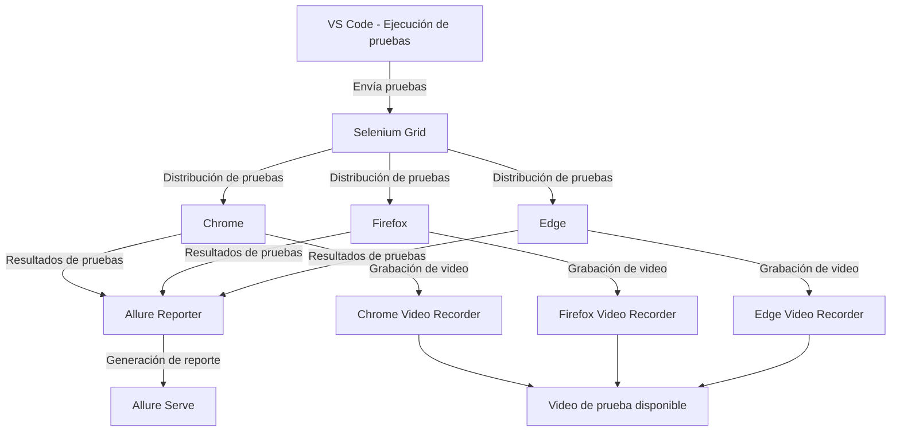

[](https://classroom.github.com/a/vK6WBQ1t)
[](https://classroom.github.com/open-in-codespaces?assignment_repo_id=15560930)

# UNIVERSIDAD PRIVADA DE TACNA
## Facultad de Ingeniería
## Escuela profesional de Ingeniería de Sistemas

### Proyecto: Juegos Florales
### Pruebas de Aceptación/Interfaz

### Integrantes:
| ID  | Nombres           | Apellidos           | Código      |
| --- | ----------------- | ------------------- | ----------- |
| 1   | Jean Pier Elias   | Valverde Zamora     | 2020066920  |
| 2   | Anthony Alexander | Cano Sucso          | 2020067573  |
___

## Creacion de test y reportes usando Selenium Grid
- Primero se crea un entorno virtual en la raíz del proyecto y luego se instala las dependencias necesarias:

```python
myenv\Scripts\activate
```
  
### Instalar pytest :

```python
pip install pytest
```
### Instalar allure-pytest para generar reportes con Allure
```python
pip install allure-pytest
```
### Instalar Selenium WebDriver
```python
pip install selenium
```
### Instalar pytest-selenium
```python
pip install pytest-selenium
```
### Instalar pytest-xdist

```python
pip install pytest-xdist
```
### Codigo para correr las pruebas en paralelo:
```python
pytest -n 3 --alluredir=./allure-results
```

### Código para visualizar los reportes en allure:
```powershell
allure serve ./allure-results
```
### Diagrama de selenium grid con allure

### Diagrama del pipeline

```mermaid
graph TD
    Commit([Commit / Push]) --> A[Build]
    A --> B[Test-Setup]
    B --> C[Test]
    C --> D[Test-Complete]
    D --> E[Deploy]

    style A fill:#333,stroke:#fff,stroke-width:2px
    style B fill:#333,stroke:#fff,stroke-width:2px
    style C fill:#333,stroke:#fff,stroke-width:2px
    style D fill:#333,stroke:#fff,stroke-width:2px
    style E fill:#333,stroke:#fff,stroke-width:2px
    style Commit fill:#333,stroke:#fff,stroke-width:2px
```


### Diagrama del funcionamiento del pipeline

```mermaid
graph TD
 
    subgraph Deploy
        E1[Job: deploy]
        E1 --> E2[Deploy Application]
    end

    subgraph Test-Complete
        D1[Job: test-complete]
        D1 --> D2[Complete Testmo Run]
    end

    subgraph Test
        C1[Job: test]
        C1 --> C2[Setup Selenium Services]
        C2 --> C3[Run Pytest Across Browsers: Chrome, Firefox, Edge]
        C3 --> C4[Send Results to Testmo]
        C4 --> C5[Generate Allure Reports]
    end

    subgraph Test-Setup
        B1[Job: test-setup]
        B1 --> B2[Setup Python Environment]
        B2 --> B3[Install Testmo CLI]
        B3 --> B4[Create Testmo Run ID]
    end

    subgraph Build
        A1[Job: build]
        A1 --> A2[Checkout Code]
        A2 --> A3[Run Build Command]
    end

    style A1 fill:#66cc66,stroke:#333,stroke-width:2px
    style B1 fill:#66cc66,stroke:#333,stroke-width:2px
    style C1 fill:#66cc66,stroke:#333,stroke-width:2px
    style D1 fill:#66cc66,stroke:#333,stroke-width:2px
    style E1 fill:#66cc66,stroke:#333,stroke-width:2px

```


